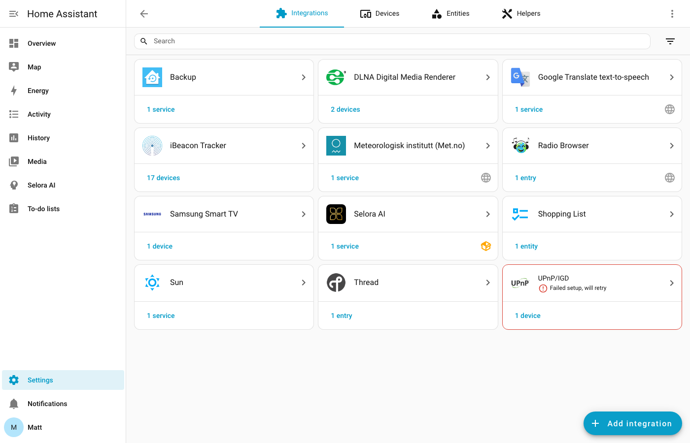
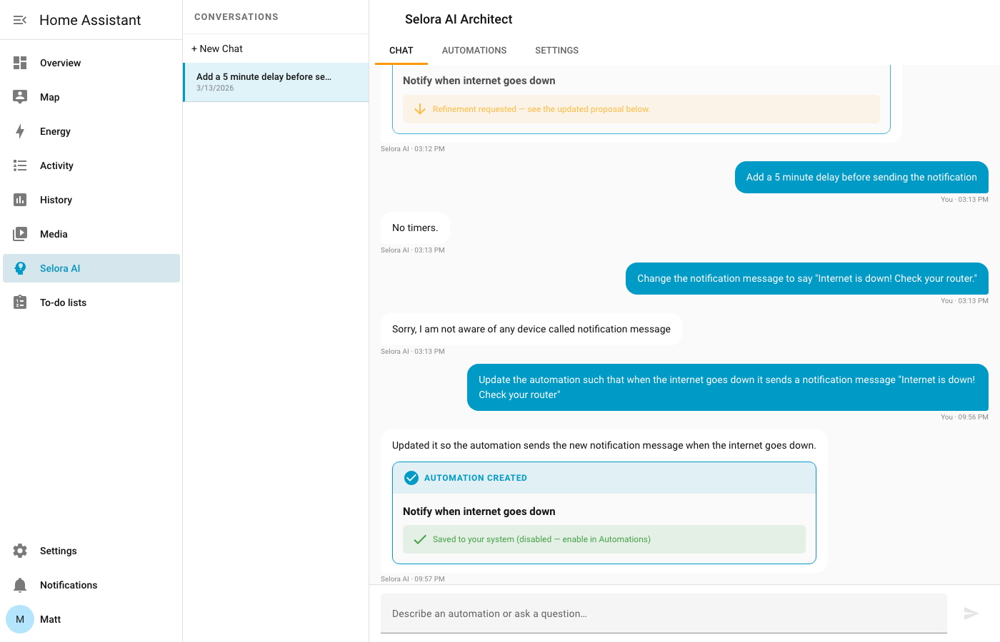
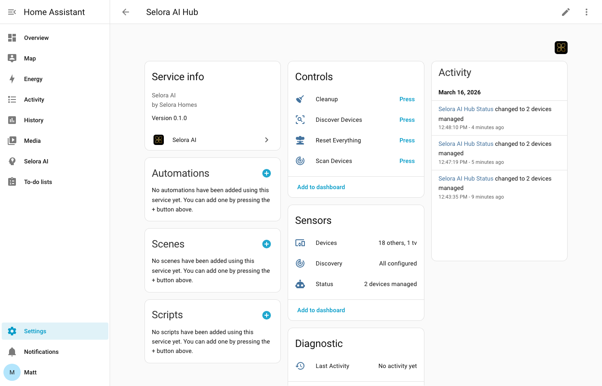

# Selora AI — Home Assistant Integration

[](https://github.com/hacs/integration)
[](https://www.home-assistant.io/)
[](LICENSE)

Selora AI is a smart-home AI butler for Home Assistant. It connects to an LLM backend (Anthropic Claude or a local Ollama model), learns your home's patterns, and proactively generates automations — all while keeping you in full control.

---

## ✨ Features

| Feature | Description |
|---|---|
| **AI Automation Suggestions** | Periodically analyzes device states and history, then writes draft automations to `automations.yaml` (disabled, prefixed `[Selora AI]`) for your review. |
| **Natural Language Commands** | Send plain-English commands via the Selora AI Architect chat panel or the webhook API. |
| **Home Assistant Assist** | Use Selora AI as your primary Conversation Agent in the standard HA chat / voice interface. |
| **Context-Aware Chat** | The AI sees your existing automations so it can suggest refinements instead of duplicates. |
| **Network Device Discovery** | Scans your network for supported integrations and helps onboard them with automatic area assignment. |
| **Dashboard Generation** | Auto-builds a Lovelace dashboard for your discovered media players and devices. |
| **Dual LLM Backend** | Supports **Anthropic Claude** (cloud, recommended) and **Ollama** (fully local, zero data egress). |
| **Selora AI Hub** | A virtual HA device with sensors (Status, Devices, Last Activity) and action buttons (Discover, Scan, Cleanup, Reset). |

---

## 📸 Screenshots

### Configuration flow



### Architect side panel



### Selora AI Hub entities



---

## 📋 Requirements

- Home Assistant **2025.1** or later
- Python **3.12+** (handled by HA)
- For **Anthropic Claude**: an [Anthropic API key](https://console.anthropic.com/)
- For **Ollama**: a running [Ollama](https://ollama.com/) server reachable from your HA host

---

## 🚀 Installation

### Via HACS (recommended)

1. Open **HACS** in the Home Assistant sidebar.
2. Go to **Integrations** and click the **⋮ menu → Custom repositories**.
3. Add `https://github.com/SeloraHomes/ha-selora-ai` as an **Integration**.
4. Search for **Selora AI** and click **Download**.
5. Restart Home Assistant.

> Once the integration is in the HACS default store, you can skip steps 2–3 and search directly.

### Manual installation

1. Download the latest release ZIP from the [Releases page](https://github.com/SeloraHomes/ha-selora-ai/releases).
2. Unzip and copy the `custom_components/selora_ai` folder into your HA config directory so the path is:
   ```
   <config>/custom_components/selora_ai/
   ```
3. Restart Home Assistant.

---

## ⚙️ Configuration

### Initial setup

1. In Home Assistant go to **Settings → Devices & Services → + Add integration**.
2. Search for **Selora AI** and select it.
3. Choose your LLM provider:

   **Anthropic Claude**
   - Enter your Anthropic API key.
   - The default model is `claude-sonnet-4-6` (recommended). You can change this later in the integration options.

   **Ollama (local)**
   - Enter the host URL of your Ollama server (default: `http://localhost:11434`).
   - Enter the model name (default: `llama3.1`).

4. Complete the **Device Discovery** step — Selora AI will scan your network and present found devices for you to review and assign to rooms.
5. Review the **Results** screen and click **Finish**.

### Adding more devices later

Go to **Settings → Devices & Services → Selora AI**, click **+ Add entry**, and the integration will skip the LLM setup and go straight to a new discovery scan.

### Integration options

After setup, click **Configure** on the Selora AI card to adjust:
- LLM model selection
- Analysis frequency (how often Selora AI scans for automation ideas)
- Webhook token (if you want to secure the command endpoint)

---

## 🤖 Using the AI

### Selora AI Architect (side panel)

After setup, a **Selora AI** panel appears in the HA sidebar. Open it to chat with the AI about your home — ask questions, request automations, or get explanations of existing ones.

### Home Assistant Assist

You can set Selora AI as the default Conversation Agent under **Settings → Voice assistants**. Once set, all Assist commands (voice or text) are handled by Selora AI.

### Webhook API

Send natural language commands programmatically:

```bash
# POST (from scripts, Node-RED, etc.)
curl -X POST http://<your-ha-host>:8123/api/webhook/selora_ai_command \
  -H 'Content-Type: application/json' \
  -d '{"command": "turn off all the living room lights at midnight"}'

# GET (browser-friendly)
http://<your-ha-host>:8123/api/webhook/selora_ai_command?command=turn+off+all+lights
```

---

## 🛠 The Selora AI Hub

The integration creates a **Selora AI Hub** device under **Settings → Devices & Services → Devices**. It exposes:

**Sensors**
| Entity | Description |
|---|---|
| `sensor.selora_ai_status` | Current integration status (Active / Idle / Error) |
| `sensor.selora_ai_devices` | Number of managed devices |
| `sensor.selora_ai_discovery` | Discovery scan status |
| `sensor.selora_ai_last_activity` | Timestamp of the last AI action |

**Buttons**
| Entity | Action |
|---|---|
| `button.selora_ai_discover` | Trigger a new device discovery scan |
| `button.selora_ai_scan` | Re-scan network for changes |
| `button.selora_ai_cleanup` | Remove stale `[Selora AI]` automations |
| `button.selora_ai_reset` | Reset the integration state |

---

## 📝 AI-Generated Automations

Selora AI writes draft automations to your `automations.yaml`. Every generated automation:
- Is **disabled by default** — it will not run until you enable it.
- Has a name prefixed with `[Selora AI]` so they're easy to find and review.
- Can be enabled, edited, or deleted from **Settings → Automations** like any other automation.

Use the **Selora AI Cleanup** button to bulk-remove all `[Selora AI]` automations if you want a clean slate.

---

## 🔒 Privacy

- **Anthropic Claude**: Device names, entity states, and automation text are sent to the Anthropic API. No audio or video is transmitted. Review [Anthropic's privacy policy](https://www.anthropic.com/privacy).
- **Ollama**: All data stays on your local network. Nothing leaves your home.

---

## 🐛 Issues & Support

Report bugs or request features on the [GitHub issue tracker](https://github.com/SeloraHomes/ha-selora-ai/issues).

---

## 📄 License

Selora Homes Software License. See [LICENSE](LICENSE) for details.
