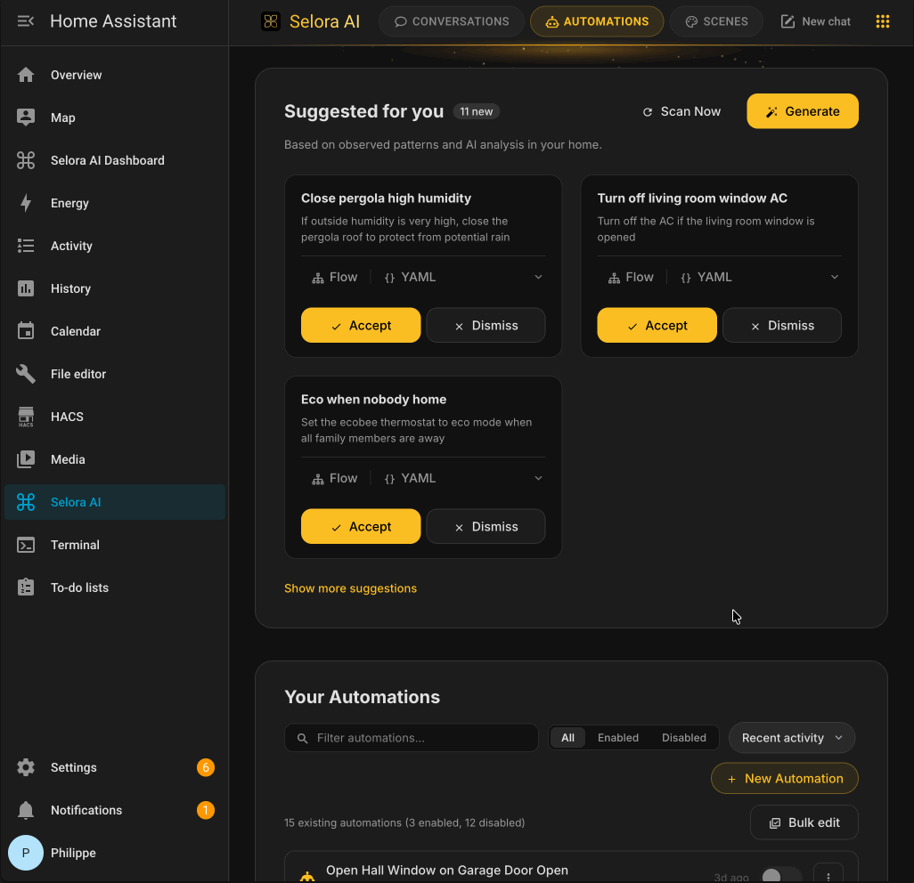

# Selora AI — Home Assistant Integration

Selora AI is a smart-home AI butler for Home Assistant. It connects to an LLM backend — **Selora AI Local** (our own on-device model), Anthropic Claude, OpenAI, Google Gemini, or Ollama — learns your home's patterns, and proactively generates automations, all while keeping you in full control.

[](https://my.home-assistant.io/redirect/hacs_repository/?category=Integration&repository=ha-selora-ai&owner=SeloraHomes)

**[Documentation](https://selorahomes.com/docs/selora-ai/)**



---

## Features

| Feature | Description |
|---|---|
| **AI Automation Suggestions** | Analyzes device states and history, then writes draft automations (disabled, prefixed `[Selora AI]`) for your review. |
| **Pattern Detection** | Detects time-based routines, device correlations, and usage sequences — then converts them into automation suggestions with confidence scoring. |
| **Natural Language Commands** | Send plain-English commands via the Selora AI panel or Home Assistant Assist. |
| **Automation Versioning** | Full version history for every Selora AI automation, with diff viewer in the panel. |
| **Stale Automation Detection** | Flags automations referencing unavailable entities or that haven't triggered in a while. |
| **MCP Server** | Exposes a [Model Context Protocol](https://modelcontextprotocol.io/) endpoint so external AI agents can interact with your home through Selora AI. |
| **Selora AI Local** (new in [v0.10.0](https://github.com/SeloraHomes/ha-selora-ai/releases/tag/v0.10.0)) | Our own 1.7B-parameter on-device model with four task-specific LoRA adapters (command, automation, answer, clarification). Runs entirely on your network — no API key, no cloud calls. See [Selora AI Local](#selora-ai-local) below. |
| **Multiple LLM Backends** | Supports **Selora AI Local** (on-device), **Anthropic Claude**, **OpenAI**, **Google Gemini**, and **Ollama**. |

---

## Requirements

- Home Assistant **2025.1** or later
- For **Selora AI Local**: a reachable Selora Hub (auto-discovered) or a self-hosted [llama-server](https://github.com/ggml-org/llama.cpp) serving the [Selora AI model](https://huggingface.co/selorahomes/Selora-AI). No API key.
- For **Anthropic Claude**: an [Anthropic API key](https://console.anthropic.com/)
- For **OpenAI**: an [OpenAI API key](https://platform.openai.com/)
- For **Google Gemini**: a [Google AI Studio API key](https://aistudio.google.com/)
- For **Ollama**: a running [Ollama](https://ollama.com/) server reachable from your HA host

---

## Installation

See the [installation guide](https://selorahomes.com/docs/selora-ai/installation/) for detailed instructions.

---

## Selora AI Local

Selora AI Local is our own task-tuned model that runs entirely on your network — **nothing leaves your home**. Released in **[v0.10.0](https://github.com/SeloraHomes/ha-selora-ai/releases/tag/v0.10.0)**, it's the recommended way to use Selora AI when privacy or offline operation matters.

### What it is

- **Base model**: Qwen3 1.7B.
- **Four LoRA adapters**, each fine-tuned on a specific Home Assistant task and hot-swapped per request:
  - `command` — execute natural-language commands ("turn off the kitchen light").
  - `automation` — generate `automations.yaml` blocks from a prompt.
  - `answer` — answer questions about your home state.
  - `clarification` — ask the user to disambiguate when intent is unclear.
- Weights, adapters, and trained system prompts are published at **[huggingface.co/selorahomes/Selora-AI](https://huggingface.co/selorahomes/Selora-AI)**.

### Where the model runs

Selora AI Local talks to a `llama-server` instance (from [llama.cpp](https://github.com/ggml-org/llama.cpp)) over its OpenAI-compatible HTTP API. Two deployment options:

1. **Selora Hub add-on** (recommended) — install the Selora Hub add-on from the Home Assistant add-on store. The integration auto-discovers it through Supervisor and pre-fills the host URL during setup.
2. **Self-hosted llama-server** — run llama-server yourself with the base model loaded and the four LoRAs registered as slots. Point the integration at `http://<host>:8080` during the *Selora AI Local* config step.

The integration handles LoRA-slot activation (`POST /lora-adapters`) per request, so the right specialist answers each call.

### Running with `llama.cpp`

Install `llama-server` from [llama.cpp](https://github.com/ggml-org/llama.cpp) (build from source, or `brew install llama.cpp` / `winget install llama.cpp`).

Download the files from [huggingface.co/selorahomes/Selora-AI](https://huggingface.co/selorahomes/Selora-AI):

- **Base model**: `qwen3_17b_base.Q6_K.gguf`.
- **LoRA adapters** (one per specialist):
  - `selora-v047-command.f16.gguf`
  - `selora-v047-automation.f16.gguf`
  - `selora-v047-answer.f16.gguf`
  - `selora-v047-clarification.f16.gguf`

Start the server with all four adapters registered but not applied — the integration activates the right one per request:

```bash
llama-server \
  --model qwen3_17b_base.Q6_K.gguf \
  --ctx-size 8192 \
  --ubatch-size 1024 \
  --n-gpu-layers 999 \
  --cache-reuse 256 \
  --mlock \
  --jinja \
  --reasoning off \
  --lora-init-without-apply \
  --lora selora-v047-command.f16.gguf,selora-v047-automation.f16.gguf,selora-v047-answer.f16.gguf,selora-v047-clarification.f16.gguf
```

Verify it's up:

```bash
curl http://localhost:8080/v1/models
```

Expected response:

```json
{"models":[{"name":"selorahomes/Selora-AI","model":"selorahomes/Selora-AI","modified_at":"","size":"","digest":"","type":"model","description":"","tags":[""],"capabilities":["completion"],"parameters":"","details":{"parent_model":"","format":"gguf","family":"","families":[""],"parameter_size":"","quantization_level":""}}],"object":"list","data":[{"id":"selorahomes/Selora-AI","aliases":["selorahomes/Selora-AI"],"tags":[],"object":"model","created":1781658061,"owned_by":"llamacpp","meta":{"vocab_type":2,"n_vocab":151936,"n_ctx":8192,"n_ctx_train":40960,"n_embd":2048,"n_params":2031739904,"size":1667055616}}]}
```

Point the integration at `http://<host>:8080` via **Settings → LLM Provider → Selora AI Local → Show Advanced Options → Host**. Generation parameters (`temperature=0.0`, stop tokens, per-intent `max_tokens` caps, LoRA hot-swap) are managed by the integration — no tuning required on the server side.

### Privacy

| | Selora AI Local | Cloud providers |
|---|---|---|
| Data egress | **None** — stays on your LAN | Sent to Anthropic / OpenAI / Google |
| API key required | No | Yes |
| Offline | Yes | No |
| Quality on complex prompts | Good (task-tuned) | Best |

---

## Learn More

| Topic | Link |
|---|---|
| **Configuration** | [Setting up LLM providers and options](https://selorahomes.com/docs/selora-ai/configuration/) |
| **Chat Panel & Assist** | [Natural language commands and voice control](https://selorahomes.com/docs/selora-ai/chat-and-assist/) |
| **AI-Generated Automations** | [How Selora AI suggests and manages automations](https://selorahomes.com/docs/selora-ai/automations/) |
| **MCP Server** | [Connecting external AI agents to your home](https://selorahomes.com/docs/selora-ai/mcp-onboarding/) |
| **Privacy & Support** | [Data privacy per provider and issue reporting](https://selorahomes.com/docs/selora-ai/privacy/) |

---

## License

Selora Homes Software License. See [LICENSE](LICENSE) for details.
