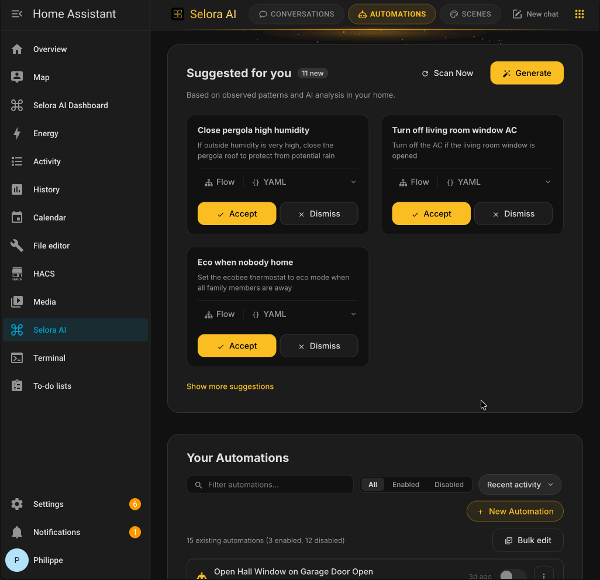

# Selora AI

An AI assistant for Home Assistant that knows your home. Ask it to do things, ask it how things are, or have it build the automations, scenes and dashboards you'd otherwise write by hand. It runs on a model of your choice, including our own model that runs entirely on your network.

[](https://github.com/SeloraHomes/ha-selora-ai/releases)
[](https://www.home-assistant.io/)
[](LICENSE)

[](https://my.home-assistant.io/redirect/hacs_repository/?category=Integration&repository=ha-selora-ai&owner=SeloraHomes)

[Documentation](https://selorahomes.com/docs/selora-ai/) · [Installation](https://selorahomes.com/docs/selora-ai/installation/) · [Releases](https://github.com/SeloraHomes/ha-selora-ai/releases) · [Report an issue](https://github.com/SeloraHomes/ha-selora-ai/issues)




## What it does

- **Chat with your home** — in its panel or through Assist: "turn off every light downstairs".
- **Automations without YAML** — describe it, review the card, accept. Every version is kept.
- **Suggestions** — automations for the routines it spots in your home's history.
- **Scenes, dashboards and helpers** — created and edited by asking.
- **Insights** — a health score for your home and what needs fixing.
- **Recipes** — ready-made setups from the [Selora catalog](https://selorahomes.com/docs/selora-ai/recipes/), installed in a few clicks.
- **MCP server** — let Claude Desktop, Cursor, n8n and other agents work with your home ([guide](https://selorahomes.com/docs/selora-ai/mcp-onboarding/)).

New automations and scenes wait for your accept, and anything destructive asks first.

## Getting started

1. **Install** through HACS with the button above, or unzip `selora_ai.zip` from the [latest release](https://github.com/SeloraHomes/ha-selora-ai/releases/latest) into `config/custom_components/selora_ai/`. Restart Home Assistant.
2. **Add the integration:** [](https://my.home-assistant.io/redirect/config_flow_start/?domain=selora_ai)
3. **Pick a model provider** (below), then open **Selora AI** in the sidebar.

Requires Home Assistant 2025.1 or later. The [installation guide](https://selorahomes.com/docs/selora-ai/installation/) covers each step in detail.

## Choose your model

| Provider | What you need | Your data |
|---|---|---|
| **Selora AI Cloud** | A Selora account. No API key. | Sent to Selora |
| **Selora AI Local** | A [llama-server](https://github.com/ggml-org/llama.cpp) on your network running our model | Stays on your network |
| **Anthropic Claude** | An [Anthropic API key](https://console.anthropic.com/) | Sent to Anthropic |
| **OpenAI** | An [OpenAI API key](https://platform.openai.com/) | Sent to OpenAI |
| **Google Gemini** | A [Google AI Studio key](https://aistudio.google.com/) | Sent to Google |
| **OpenRouter** | An [OpenRouter key](https://openrouter.ai/keys) | Sent to OpenRouter and the model's provider |
| **Ollama** | An [Ollama](https://ollama.com/) server on your network | Stays on your network |

You can switch providers at any time from the panel's settings. Details per provider are in the [configuration guide](https://selorahomes.com/docs/selora-ai/configuration/) and the [privacy page](https://selorahomes.com/docs/selora-ai/privacy/).

## Selora AI Local

Our own model, trained for Home Assistant, that runs entirely on your hardware: nothing leaves your network and no API key is needed. It is a Qwen3 1.7B base with five specialist adapters (commands, automations, answers, clarifying questions, and how-to help), and the integration picks the right one for each request.

The weights, adapters and trained prompts are on Hugging Face at [selorahomes/Selora-AI-LLM-1.7B](https://huggingface.co/selorahomes/Selora-AI-LLM-1.7B). Download the base model and the five adapters, then start `llama-server` from [llama.cpp](https://github.com/ggml-org/llama.cpp) (`brew install llama.cpp`, `winget install llama.cpp`, or build it):

```bash
llama-server \
  --model qwen3_17b_base.Q6_K.gguf \
  --ctx-size 8192 --ubatch-size 1024 --n-gpu-layers 999 \
  --parallel 1 --cache-reuse 256 --cache-ram 0 --mlock \
  --jinja --reasoning off \
  --lora-init-without-apply \
  --lora selora-command.f16.gguf,selora-automation.f16.gguf,selora-answer.f16.gguf,selora-clarification.f16.gguf,selora-utilities.f16.gguf
```

Keep `--cache-ram 0`: llama-server's host-memory prompt cache does not track which adapter computed an entry, so it can hand one specialist another's cached state.

When you set it up, Selora AI looks for a server on the usual addresses and fills it in; otherwise enter `http://<host>:8080`. Temperature, stop tokens, output limits and adapter choice are all handled by the integration.

## Languages

The interface is translated into English, French, German, Spanish, Italian, Dutch, Hungarian, Portuguese, Russian, Japanese, Korean, and Simplified and Traditional Chinese.

Replies come in the language you write in, or your Home Assistant language. Reply languages: English, French, German, Spanish, Italian, Portuguese, Dutch, Polish, Swedish, Danish, Norwegian, Finnish, Czech, Russian, Ukrainian, Turkish, Hungarian, Japanese, Korean and Chinese. Any other language gets English replies.

## Privacy

- Your home's data goes only to the model provider you choose. With Selora AI Local or Ollama, it never leaves your network.
- Token usage and cost are tracked locally, in the panel's Usage view.
- Anonymous usage statistics are **off by default** and only sent if you opt in. They hold counts and versions, never entity names, messages or replies.

## Contributing

Development happens on [GitLab](https://gitlab.com/selorahomes/products/selora-ai/ha-integration/); this GitHub repository is a read-only mirror that HACS installs from. Issues are welcome here; merge requests go to GitLab. See [CONTRIBUTING.md](CONTRIBUTING.md) to get a development setup running.

## License

[MIT](LICENSE) © Selora Homes
